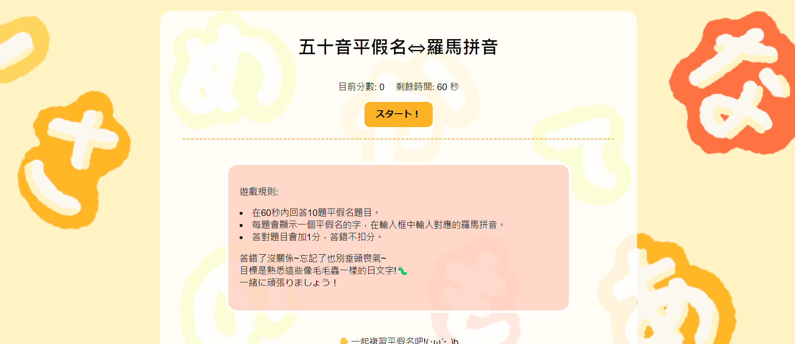
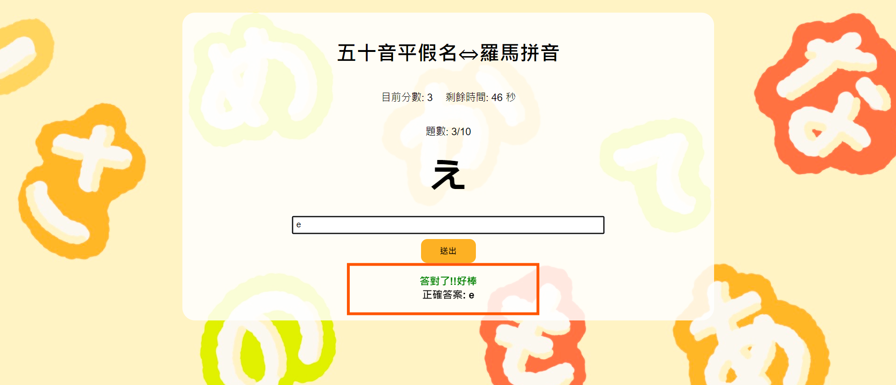
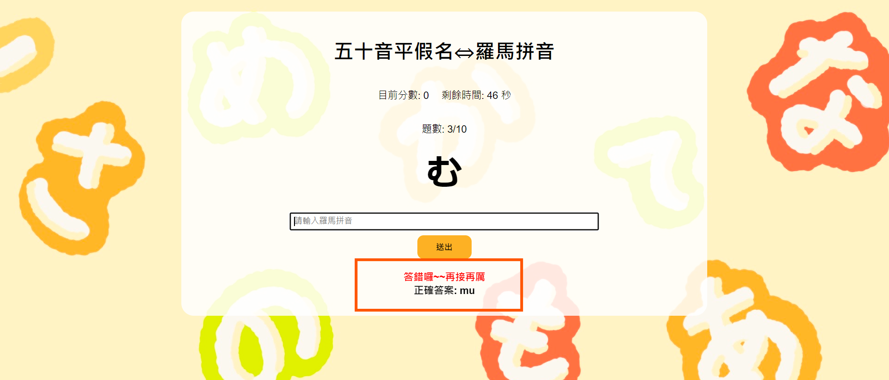
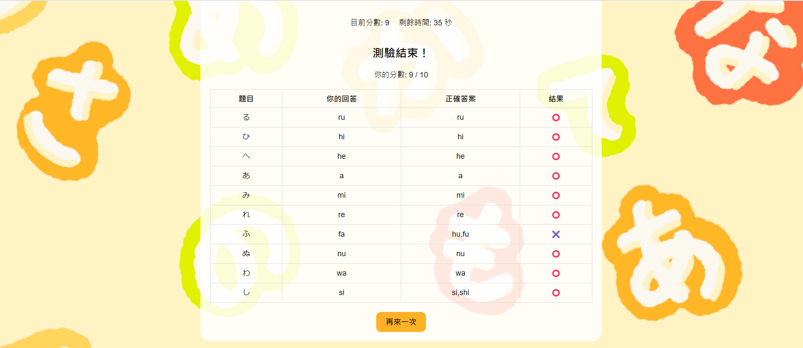

# 日文五十音測驗

遊戲規則:
 - 勾選要測驗的項目:平假名/片假名/濁音/半濁音/拗音
 - 計時60秒，回答15題題目
 - 每題會顯示一個日文字，在輸入框中輸入對應的羅馬拼音
 - 答對題目加1分，答錯不扣分

 查看網站→ [Page](https://sanaaa1017.github.io/nihongo-game/)

### 遊戲畫面

首頁

進入遊戲

回答正確

回答錯誤

成績計算&查看題目與答案

