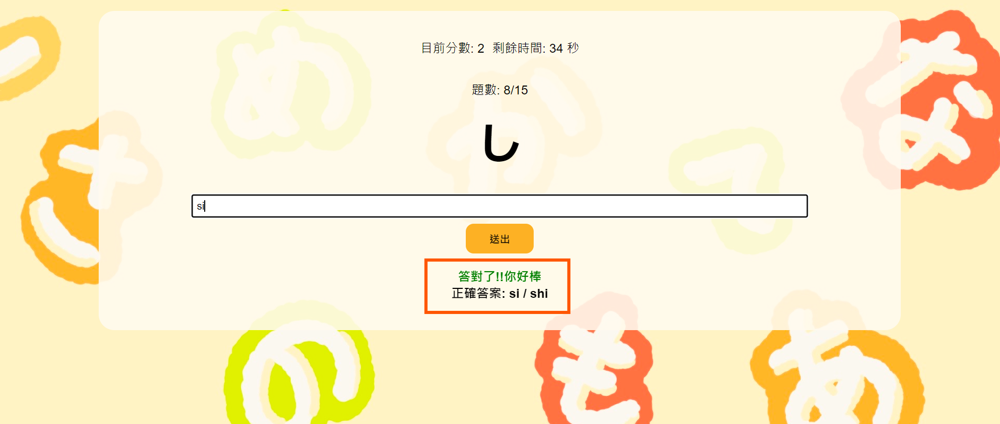

# 日文平假名轉羅馬拼音練習

遊戲規則:
 - 在60秒內回答10題平假名題目。
 - 每題會顯示一個平假名的字，在輸入框中輸入對應的羅馬拼音。
 - 答對題目會加1分，答錯不扣分。

 查看網站→ [Page](https://sanaaa1017.github.io/nihongo-game/)

### 遊戲畫面

首頁

平假名表格

進入遊戲

回答正確

回答錯誤

成績計算&查看題目與答案

